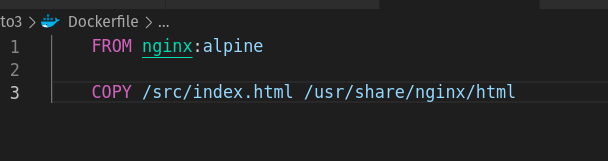
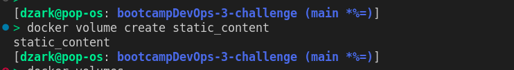
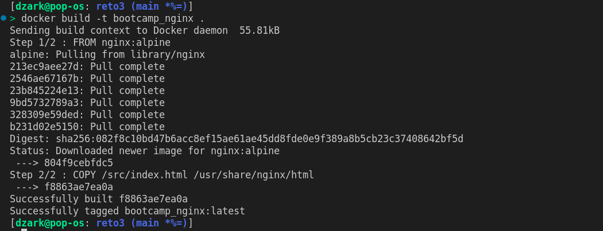
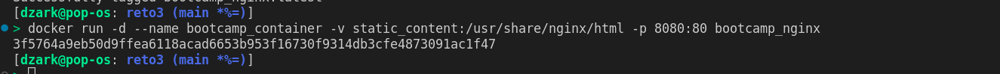
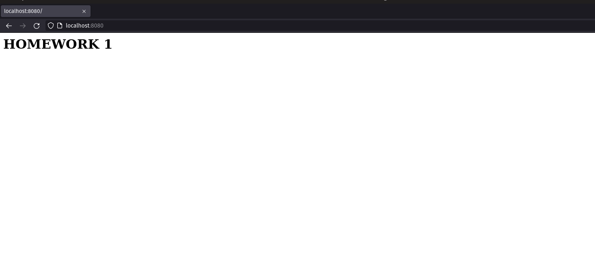
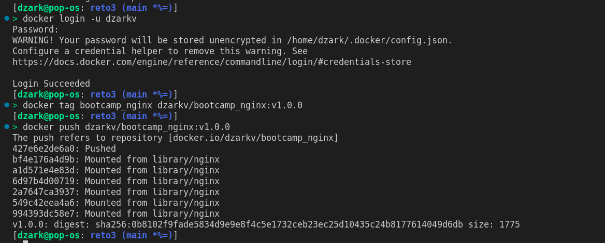

# Pantallazos del ejercicio del reto 3

1. Creación Dockerfile
   
2. Creación del volumen
   
3. Construir la imagen del contenedor
   
4. Creación del contenedor utilizando la imagen construida
   
5. Comprobación de acceso 
   
6. Despliegue a DockerHub
   
