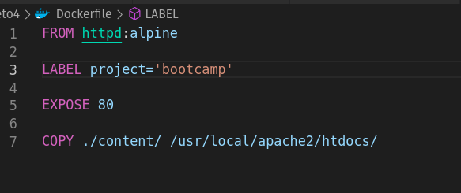

# Pantallazos del ejercicio del reto 4

1. Creación Dockerfile de imagen de Apache
   
2. Creación del contenedor con la nueva imagen co puerto 5050
   
3. Inspección de la cantidad de capas de la imagen
   
   