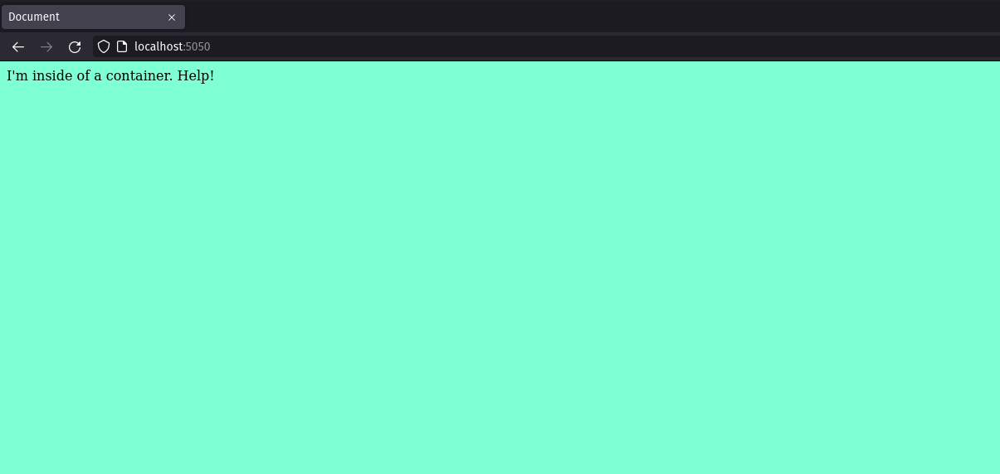
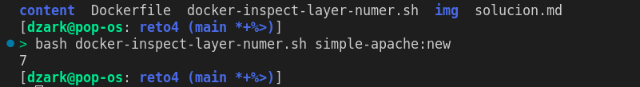

# Pantallazos del ejercicio del reto 4

1. Creación Dockerfile de imagen de Apache
   <ul><li>- [x] <a href=https://github.com/dzarkV/bootcampDevOps-3-challenge/blob/main/reto4/Dockerfile target=_blank>Hecho</a></li></ul>
2. Creación del contenedor con la nueva imagen con puerto 5050
   
3. Inspección de la cantidad de capas de la imagen
   
   