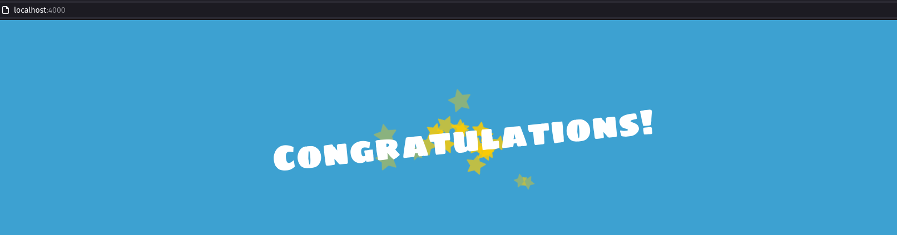

# Pantallazos del ejercicio del reto 5

1. Creación script de imagen, contenedor y registro de aplicación `Node.js`
   <ul><li>- [x] <a href=https://github.com/dzarkV/bootcampDevOps-3-challenge/blob/main/reto5/reto5-automate.sh target=_blank>Hecho</a></li></ul>
2. Resultado del contenedor corriendo
   
   